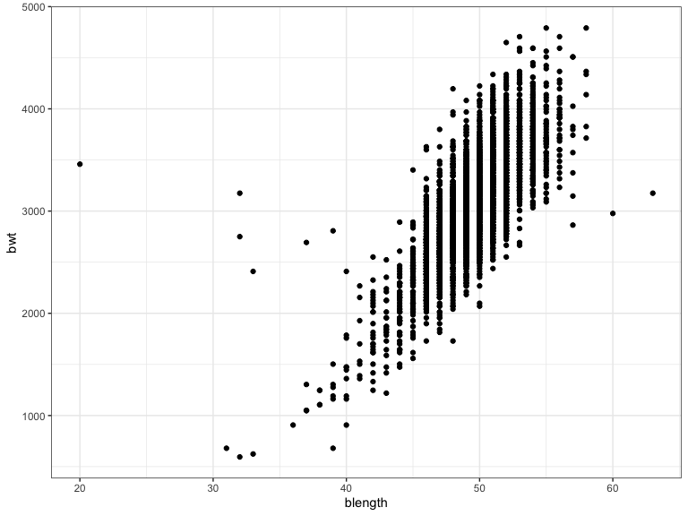
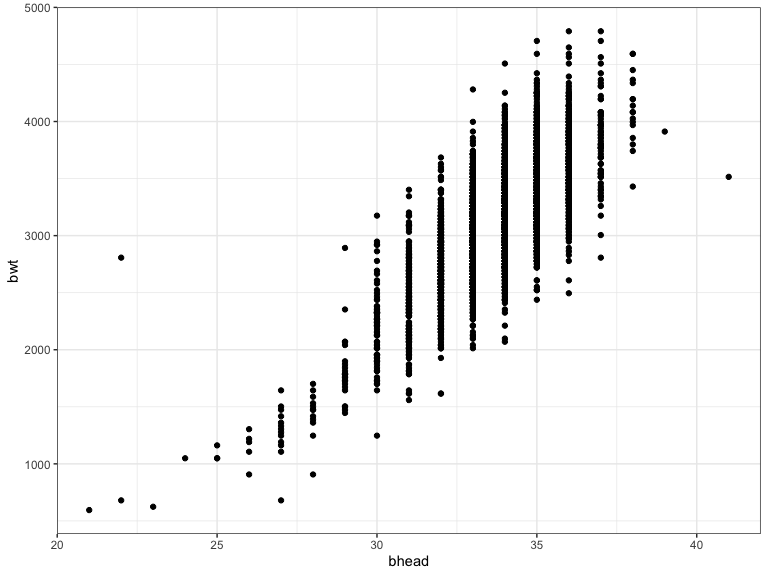
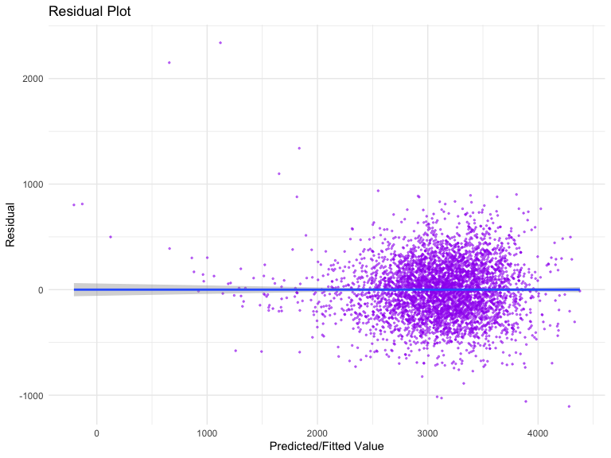
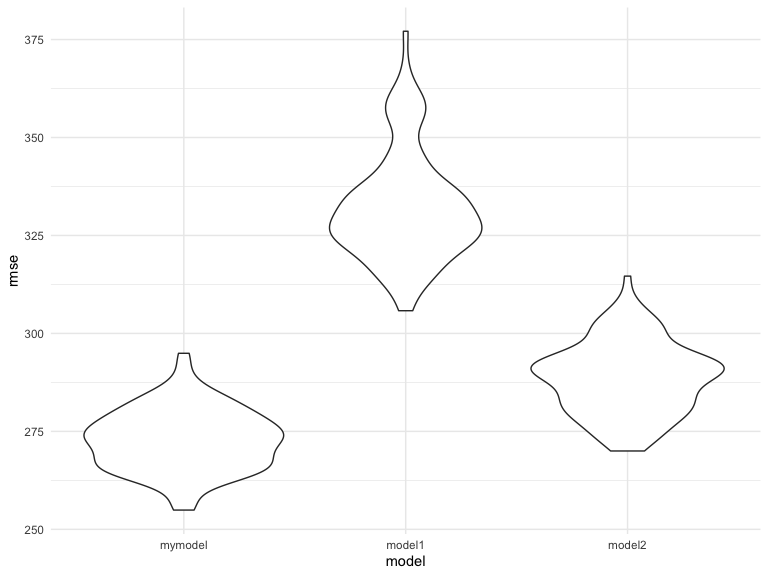
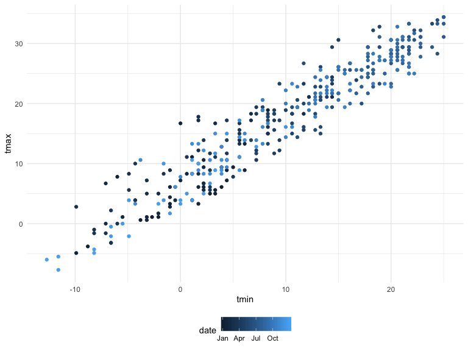
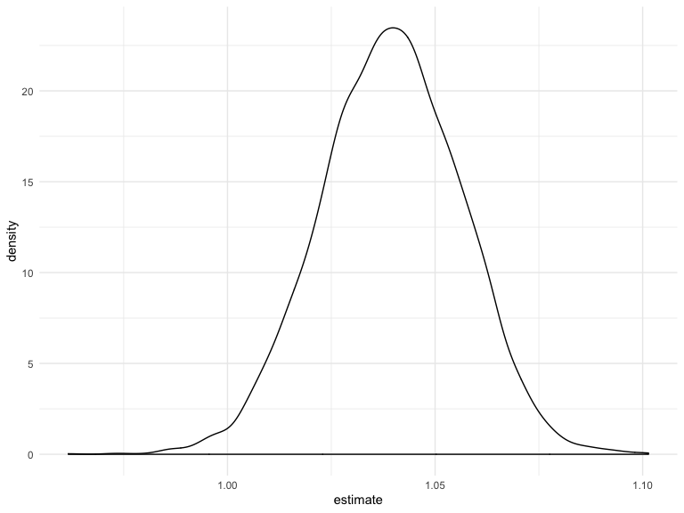
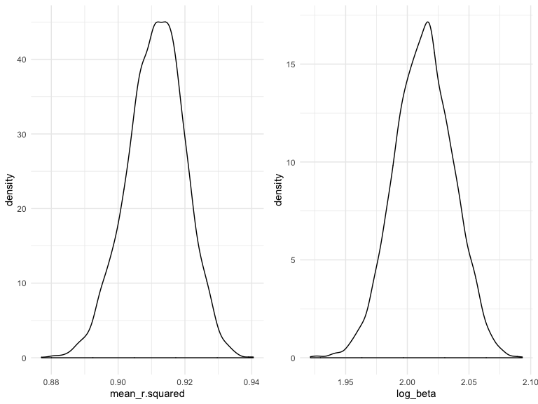

p8105\_hw6\_sl4662
================
Siying Li
11/18/2019

# Problem 1

## Data Cleaning

``` r
birth_data = read.csv("./data/birthweight.csv")

check_class = lapply(birth_data, class)

birth_data = 
  birth_data %>% 
  mutate(
    babysex = factor(babysex, levels = c("1","2")),
    babysex = fct_recode(babysex, 
                           "male" = "1", 
                           "female" = "2"),
    frace = factor(frace, levels = c("1", "2", "3", "4", "8", "9")),
    frace = fct_recode(frace, 
                         "white" = "1", 
                         "black" = "2",
                         "asian" = "3",
                         "puerto_rican" = "4",
                         "other" = "8",
                         "unknown" = "9"),
    malform = factor(malform, levels = c("1","0")),
    malform = fct_recode(malform, 
                         "absent" = "0", 
                         "present" = "1"),
    mrace = factor(mrace, levels = c("1", "2", "3", "4", "8")),
    mrace = fct_recode(mrace, 
                         "white" = "1", 
                         "black" = "2",
                         "asian" = "3",
                         "puerto_rican" = "4",
                         "other" = "8"),
    id = 1:4342,
         )
```

## Build my model

``` r
birth_data %>% 
  ggplot(aes(x = blength, y = bwt)) + 
  geom_point() + theme_bw()
```



``` r
birth_data %>% 
  ggplot(aes(x = bhead, y = bwt)) + 
  geom_point() + theme_bw()
```



``` r
birth_data = 
  birth_data %>% 
  mutate(
    babysex = fct_infreq(babysex),
    frace = fct_infreq(frace),
    malform = fct_infreq(malform),
    mrace = fct_infreq(mrace),
    )

# Backward elimination:
everything_fit = lm(formula = bwt ~ . -id, data = birth_data) 
summary(everything_fit)
```

    ## 
    ## Call:
    ## lm(formula = bwt ~ . - id, data = birth_data)
    ## 
    ## Residuals:
    ##      Min       1Q   Median       3Q      Max 
    ## -1097.68  -184.86    -3.33   173.09  2344.15 
    ## 
    ## Coefficients: (3 not defined because of singularities)
    ##                     Estimate Std. Error t value Pr(>|t|)    
    ## (Intercept)       -6265.3914   660.4011  -9.487  < 2e-16 ***
    ## babysexfemale        28.7073     8.4652   3.391 0.000702 ***
    ## bhead               130.7781     3.4523  37.881  < 2e-16 ***
    ## blength              74.9536     2.0217  37.075  < 2e-16 ***
    ## delwt                 4.1007     0.3948  10.386  < 2e-16 ***
    ## fincome               0.2898     0.1795   1.614 0.106551    
    ## fraceblack           14.3313    46.1501   0.311 0.756168    
    ## fracepuerto_rican   -46.9962    44.6782  -1.052 0.292912    
    ## fraceasian           21.2361    69.2960   0.306 0.759273    
    ## fraceother            4.2969    74.0741   0.058 0.953745    
    ## gaweeks              11.5494     1.4654   7.882 4.06e-15 ***
    ## malformpresent        9.7650    70.6259   0.138 0.890039    
    ## menarche             -3.5508     2.8951  -1.226 0.220083    
    ## mheight               9.7874    10.3116   0.949 0.342588    
    ## momage                0.7593     1.2221   0.621 0.534418    
    ## mraceblack         -151.4354    46.0453  -3.289 0.001014 ** 
    ## mracepuerto_rican   -56.4787    45.1369  -1.251 0.210901    
    ## mraceasian          -91.3866    71.9190  -1.271 0.203908    
    ## parity               95.5411    40.4793   2.360 0.018307 *  
    ## pnumlbw                   NA         NA      NA       NA    
    ## pnumsga                   NA         NA      NA       NA    
    ## ppbmi                 4.3538    14.8913   0.292 0.770017    
    ## ppwt                 -3.4716     2.6121  -1.329 0.183913    
    ## smoken               -4.8544     0.5871  -8.269  < 2e-16 ***
    ## wtgain                    NA         NA      NA       NA    
    ## ---
    ## Signif. codes:  0 '***' 0.001 '**' 0.01 '*' 0.05 '.' 0.1 ' ' 1
    ## 
    ## Residual standard error: 272.5 on 4320 degrees of freedom
    ## Multiple R-squared:  0.7183, Adjusted R-squared:  0.717 
    ## F-statistic: 524.6 on 21 and 4320 DF,  p-value: < 2.2e-16

``` r
# No NAs (pnumlbw, wtgain, pnumsga)
step1<-update(everything_fit, . ~ . -pnumlbw -wtgain -pnumsga)
summary(step1)
```

    ## 
    ## Call:
    ## lm(formula = bwt ~ babysex + bhead + blength + delwt + fincome + 
    ##     frace + gaweeks + malform + menarche + mheight + momage + 
    ##     mrace + parity + ppbmi + ppwt + smoken, data = birth_data)
    ## 
    ## Residuals:
    ##      Min       1Q   Median       3Q      Max 
    ## -1097.68  -184.86    -3.33   173.09  2344.15 
    ## 
    ## Coefficients:
    ##                     Estimate Std. Error t value Pr(>|t|)    
    ## (Intercept)       -6265.3914   660.4011  -9.487  < 2e-16 ***
    ## babysexfemale        28.7073     8.4652   3.391 0.000702 ***
    ## bhead               130.7781     3.4523  37.881  < 2e-16 ***
    ## blength              74.9536     2.0217  37.075  < 2e-16 ***
    ## delwt                 4.1007     0.3948  10.386  < 2e-16 ***
    ## fincome               0.2898     0.1795   1.614 0.106551    
    ## fraceblack           14.3313    46.1501   0.311 0.756168    
    ## fracepuerto_rican   -46.9962    44.6782  -1.052 0.292912    
    ## fraceasian           21.2361    69.2960   0.306 0.759273    
    ## fraceother            4.2969    74.0741   0.058 0.953745    
    ## gaweeks              11.5494     1.4654   7.882 4.06e-15 ***
    ## malformpresent        9.7650    70.6259   0.138 0.890039    
    ## menarche             -3.5508     2.8951  -1.226 0.220083    
    ## mheight               9.7874    10.3116   0.949 0.342588    
    ## momage                0.7593     1.2221   0.621 0.534418    
    ## mraceblack         -151.4354    46.0453  -3.289 0.001014 ** 
    ## mracepuerto_rican   -56.4787    45.1369  -1.251 0.210901    
    ## mraceasian          -91.3866    71.9190  -1.271 0.203908    
    ## parity               95.5411    40.4793   2.360 0.018307 *  
    ## ppbmi                 4.3538    14.8913   0.292 0.770017    
    ## ppwt                 -3.4716     2.6121  -1.329 0.183913    
    ## smoken               -4.8544     0.5871  -8.269  < 2e-16 ***
    ## ---
    ## Signif. codes:  0 '***' 0.001 '**' 0.01 '*' 0.05 '.' 0.1 ' ' 1
    ## 
    ## Residual standard error: 272.5 on 4320 degrees of freedom
    ## Multiple R-squared:  0.7183, Adjusted R-squared:  0.717 
    ## F-statistic: 524.6 on 21 and 4320 DF,  p-value: < 2.2e-16

``` r
# No momage
step2<-update(step1, . ~ . -momage)
summary(step2)
```

    ## 
    ## Call:
    ## lm(formula = bwt ~ babysex + bhead + blength + delwt + fincome + 
    ##     frace + gaweeks + malform + menarche + mheight + mrace + 
    ##     parity + ppbmi + ppwt + smoken, data = birth_data)
    ## 
    ## Residuals:
    ##      Min       1Q   Median       3Q      Max 
    ## -1098.31  -184.50    -2.96   173.50  2344.93 
    ## 
    ## Coefficients:
    ##                     Estimate Std. Error t value Pr(>|t|)    
    ## (Intercept)       -6266.0275   660.3534  -9.489  < 2e-16 ***
    ## babysexfemale        28.5504     8.4609   3.374 0.000746 ***
    ## bhead               130.7972     3.4519  37.891  < 2e-16 ***
    ## blength              74.9360     2.0213  37.073  < 2e-16 ***
    ## delwt                 4.0798     0.3934  10.372  < 2e-16 ***
    ## fincome               0.3139     0.1753   1.791 0.073405 .  
    ## fraceblack           13.6273    46.1329   0.295 0.767708    
    ## fracepuerto_rican   -47.0460    44.6750  -1.053 0.292366    
    ## fraceasian           22.4510    69.2635   0.324 0.745848    
    ## fraceother            3.5191    74.0582   0.048 0.962102    
    ## gaweeks              11.6001     1.4630   7.929 2.79e-15 ***
    ## malformpresent       10.6789    70.6056   0.151 0.879788    
    ## menarche             -3.2104     2.8426  -1.129 0.258789    
    ## mheight               9.9069    10.3090   0.961 0.336612    
    ## mraceblack         -152.2783    46.0221  -3.309 0.000945 ***
    ## mracepuerto_rican   -57.1387    45.1212  -1.266 0.205460    
    ## mraceasian          -89.2033    71.8280  -1.242 0.214340    
    ## parity               97.3834    40.3677   2.412 0.015889 *  
    ## ppbmi                 4.5381    14.8873   0.305 0.760510    
    ## ppwt                 -3.4617     2.6119  -1.325 0.185119    
    ## smoken               -4.8568     0.5870  -8.274  < 2e-16 ***
    ## ---
    ## Signif. codes:  0 '***' 0.001 '**' 0.01 '*' 0.05 '.' 0.1 ' ' 1
    ## 
    ## Residual standard error: 272.5 on 4321 degrees of freedom
    ## Multiple R-squared:  0.7183, Adjusted R-squared:  0.717 
    ## F-statistic: 550.9 on 20 and 4321 DF,  p-value: < 2.2e-16

``` r
# No ppbmi
step3<-update(step2, . ~ . -ppbmi)
summary(step3)
```

    ## 
    ## Call:
    ## lm(formula = bwt ~ babysex + bhead + blength + delwt + fincome + 
    ##     frace + gaweeks + malform + menarche + mheight + mrace + 
    ##     parity + ppwt + smoken, data = birth_data)
    ## 
    ## Residuals:
    ##      Min       1Q   Median       3Q      Max 
    ## -1096.77  -184.23    -3.49   173.42  2344.91 
    ## 
    ## Coefficients:
    ##                     Estimate Std. Error t value Pr(>|t|)    
    ## (Intercept)       -6069.3003   139.8729 -43.392  < 2e-16 ***
    ## babysexfemale        28.5264     8.4596   3.372 0.000753 ***
    ## bhead               130.8285     3.4500  37.921  < 2e-16 ***
    ## blength              74.9388     2.0211  37.078  < 2e-16 ***
    ## delwt                 4.0784     0.3933  10.370  < 2e-16 ***
    ## fincome               0.3152     0.1752   1.799 0.072142 .  
    ## fraceblack           13.7725    46.1256   0.299 0.765271    
    ## fracepuerto_rican   -47.1380    44.6693  -1.055 0.291362    
    ## fraceasian           22.3613    69.2556   0.323 0.746801    
    ## fraceother            3.8597    74.0420   0.052 0.958429    
    ## gaweeks              11.5970     1.4628   7.928 2.81e-15 ***
    ## malformpresent       10.5283    70.5964   0.149 0.881455    
    ## menarche             -3.2308     2.8415  -1.137 0.255597    
    ## mheight               6.8127     1.8005   3.784 0.000157 ***
    ## mraceblack         -152.4044    46.0154  -3.312 0.000934 ***
    ## mracepuerto_rican   -57.2746    45.1142  -1.270 0.204315    
    ## mraceasian          -89.8037    71.7934  -1.251 0.211052    
    ## parity               97.2174    40.3597   2.409 0.016048 *  
    ## ppwt                 -2.6763     0.4277  -6.258 4.29e-10 ***
    ## smoken               -4.8587     0.5869  -8.278  < 2e-16 ***
    ## ---
    ## Signif. codes:  0 '***' 0.001 '**' 0.01 '*' 0.05 '.' 0.1 ' ' 1
    ## 
    ## Residual standard error: 272.4 on 4322 degrees of freedom
    ## Multiple R-squared:  0.7183, Adjusted R-squared:  0.7171 
    ## F-statistic:   580 on 19 and 4322 DF,  p-value: < 2.2e-16

``` r
# No frace
step4<-update(step3, . ~ . -frace)
summary(step4)
```

    ## 
    ## Call:
    ## lm(formula = bwt ~ babysex + bhead + blength + delwt + fincome + 
    ##     gaweeks + malform + menarche + mheight + mrace + parity + 
    ##     ppwt + smoken, data = birth_data)
    ## 
    ## Residuals:
    ##      Min       1Q   Median       3Q      Max 
    ## -1096.16  -184.96    -3.03   173.71  2343.80 
    ## 
    ## Coefficients:
    ##                     Estimate Std. Error t value Pr(>|t|)    
    ## (Intercept)       -6070.6454   139.7794 -43.430  < 2e-16 ***
    ## babysexfemale        28.4965     8.4568   3.370 0.000759 ***
    ## bhead               130.8473     3.4475  37.954  < 2e-16 ***
    ## blength              74.8980     2.0200  37.078  < 2e-16 ***
    ## delwt                 4.0775     0.3930  10.376  < 2e-16 ***
    ## fincome               0.3154     0.1748   1.804 0.071289 .  
    ## gaweeks              11.6125     1.4623   7.941 2.53e-15 ***
    ## malformpresent       10.6141    70.5746   0.150 0.880460    
    ## menarche             -3.2946     2.8387  -1.161 0.245866    
    ## mheight               6.8574     1.7991   3.812 0.000140 ***
    ## mraceblack         -138.7114     9.9113 -13.995  < 2e-16 ***
    ## mracepuerto_rican  -100.0916    19.3360  -5.176 2.36e-07 ***
    ## mraceasian          -71.4085    42.4218  -1.683 0.092390 .  
    ## parity               97.3253    40.3485   2.412 0.015902 *  
    ## ppwt                 -2.6770     0.4276  -6.261 4.19e-10 ***
    ## smoken               -4.8327     0.5859  -8.248  < 2e-16 ***
    ## ---
    ## Signif. codes:  0 '***' 0.001 '**' 0.01 '*' 0.05 '.' 0.1 ' ' 1
    ## 
    ## Residual standard error: 272.4 on 4326 degrees of freedom
    ## Multiple R-squared:  0.7182, Adjusted R-squared:  0.7172 
    ## F-statistic:   735 on 15 and 4326 DF,  p-value: < 2.2e-16

``` r
# No malform
step5<-update(step4, . ~ . -malform)
summary(step5)
```

    ## 
    ## Call:
    ## lm(formula = bwt ~ babysex + bhead + blength + delwt + fincome + 
    ##     gaweeks + menarche + mheight + mrace + parity + ppwt + smoken, 
    ##     data = birth_data)
    ## 
    ## Residuals:
    ##      Min       1Q   Median       3Q      Max 
    ## -1096.14  -184.98    -2.86   173.65  2343.59 
    ## 
    ## Coefficients:
    ##                     Estimate Std. Error t value Pr(>|t|)    
    ## (Intercept)       -6070.1897   139.7308 -43.442  < 2e-16 ***
    ## babysexfemale        28.4769     8.4548   3.368 0.000763 ***
    ## bhead               130.8513     3.4470  37.961  < 2e-16 ***
    ## blength              74.8931     2.0195  37.085  < 2e-16 ***
    ## delwt                 4.0794     0.3927  10.387  < 2e-16 ***
    ## fincome               0.3149     0.1748   1.802 0.071621 .  
    ## gaweeks              11.6105     1.4621   7.941 2.54e-15 ***
    ## menarche             -3.2979     2.8383  -1.162 0.245327    
    ## mheight               6.8542     1.7988   3.810 0.000141 ***
    ## mraceblack         -138.7506     9.9068 -14.006  < 2e-16 ***
    ## mracepuerto_rican  -100.1555    19.3291  -5.182 2.30e-07 ***
    ## mraceasian          -71.4559    42.4158  -1.685 0.092128 .  
    ## parity               97.3088    40.3438   2.412 0.015907 *  
    ## ppwt                 -2.6787     0.4273  -6.268 4.01e-10 ***
    ## smoken               -4.8305     0.5857  -8.248  < 2e-16 ***
    ## ---
    ## Signif. codes:  0 '***' 0.001 '**' 0.01 '*' 0.05 '.' 0.1 ' ' 1
    ## 
    ## Residual standard error: 272.3 on 4327 degrees of freedom
    ## Multiple R-squared:  0.7182, Adjusted R-squared:  0.7173 
    ## F-statistic: 787.7 on 14 and 4327 DF,  p-value: < 2.2e-16

``` r
# No fincome
step6<-update(step5, . ~ . -fincome)
summary(step6)
```

    ## 
    ## Call:
    ## lm(formula = bwt ~ babysex + bhead + blength + delwt + gaweeks + 
    ##     menarche + mheight + mrace + parity + ppwt + smoken, data = birth_data)
    ## 
    ## Residuals:
    ##     Min      1Q  Median      3Q     Max 
    ## -1105.0  -183.0    -3.7   173.0  2328.8 
    ## 
    ## Coefficients:
    ##                     Estimate Std. Error t value Pr(>|t|)    
    ## (Intercept)       -6072.4765   139.7613 -43.449  < 2e-16 ***
    ## babysexfemale        28.2924     8.4564   3.346 0.000828 ***
    ## bhead               131.0964     3.4452  38.052  < 2e-16 ***
    ## blength              74.7395     2.0182  37.032  < 2e-16 ***
    ## delwt                 4.0563     0.3926  10.331  < 2e-16 ***
    ## gaweeks              11.6961     1.4617   8.002 1.56e-15 ***
    ## menarche             -3.3763     2.8387  -1.189 0.234363    
    ## mheight               7.1206     1.7932   3.971 7.28e-05 ***
    ## mraceblack         -145.2665     9.2256 -15.746  < 2e-16 ***
    ## mracepuerto_rican  -105.3990    19.1138  -5.514 3.71e-08 ***
    ## mraceasian          -74.4348    42.3946  -1.756 0.079200 .  
    ## parity               95.8531    40.3462   2.376 0.017556 *  
    ## ppwt                 -2.6541     0.4272  -6.212 5.72e-10 ***
    ## smoken               -4.8603     0.5856  -8.300  < 2e-16 ***
    ## ---
    ## Signif. codes:  0 '***' 0.001 '**' 0.01 '*' 0.05 '.' 0.1 ' ' 1
    ## 
    ## Residual standard error: 272.4 on 4328 degrees of freedom
    ## Multiple R-squared:  0.718,  Adjusted R-squared:  0.7171 
    ## F-statistic: 847.6 on 13 and 4328 DF,  p-value: < 2.2e-16

``` r
# No menarche
mymodel<-update(step6, . ~ . -menarche)
summary(mymodel)
```

    ## 
    ## Call:
    ## lm(formula = bwt ~ babysex + bhead + blength + delwt + gaweeks + 
    ##     mheight + mrace + parity + ppwt + smoken, data = birth_data)
    ## 
    ## Residuals:
    ##      Min       1Q   Median       3Q      Max 
    ## -1106.16  -183.65    -2.51   174.67  2338.68 
    ## 
    ## Coefficients:
    ##                     Estimate Std. Error t value Pr(>|t|)    
    ## (Intercept)       -6101.8188   137.5732 -44.353  < 2e-16 ***
    ## babysexfemale        28.3735     8.4565   3.355 0.000800 ***
    ## bhead               131.0228     3.4448  38.035  < 2e-16 ***
    ## blength              74.7933     2.0178  37.066  < 2e-16 ***
    ## delwt                 4.0840     0.3920  10.419  < 2e-16 ***
    ## gaweeks              11.6785     1.4617   7.990 1.72e-15 ***
    ## mheight               6.8569     1.7795   3.853 0.000118 ***
    ## mraceblack         -145.3753     9.2256 -15.758  < 2e-16 ***
    ## mracepuerto_rican  -105.9871    19.1083  -5.547 3.09e-08 ***
    ## mraceasian          -77.9781    42.2918  -1.844 0.065279 .  
    ## parity               94.8103    40.3386   2.350 0.018800 *  
    ## ppwt                 -2.6507     0.4273  -6.204 6.02e-10 ***
    ## smoken               -4.8738     0.5855  -8.324  < 2e-16 ***
    ## ---
    ## Signif. codes:  0 '***' 0.001 '**' 0.01 '*' 0.05 '.' 0.1 ' ' 1
    ## 
    ## Residual standard error: 272.4 on 4329 degrees of freedom
    ## Multiple R-squared:  0.7179, Adjusted R-squared:  0.7171 
    ## F-statistic:   918 on 12 and 4329 DF,  p-value: < 2.2e-16

### Use method of backward elimination learned in Biostatistics class, which takes out non-significant variables ‘one at a time’, starting with the highest p-value. Conclusion is that predictors are: `babysex`, `bhead`, `blength`, `delwt`, `gaweeks`, `mheight`, `mrace`, `parity`, `ppwt`, `smoken`.

``` r
prediction_residual = 
  birth_data %>% 
  add_predictions(mymodel) %>% 
  add_residuals(mymodel)

prediction_residual %>% 
  ggplot(aes(x = pred, y = resid)) + 
  geom_point(color = "purple", alpha = 0.5, size = 0.5) +
  geom_smooth(method = "lm") +
  labs(x = "Predicted/Fitted Value",
       y = "Residual", 
       title = "Residual Plot")
```



### As shown in the plot, residues has a random pattern and evenly distrubuted around 0.

## Compare with model:

### 1: using length at birth and gestational age as predictors (main effects only)

### 2: using head circumference, length, sex, and all interactions (including the three-way interaction) between these

``` r
model1 = lm(formula = bwt ~ blength + gaweeks, data = birth_data) 
summary(model1)
```

    ## 
    ## Call:
    ## lm(formula = bwt ~ blength + gaweeks, data = birth_data)
    ## 
    ## Residuals:
    ##     Min      1Q  Median      3Q     Max 
    ## -1709.6  -215.4   -11.4   208.2  4188.8 
    ## 
    ## Coefficients:
    ##              Estimate Std. Error t value Pr(>|t|)    
    ## (Intercept) -4347.667     97.958  -44.38   <2e-16 ***
    ## blength       128.556      1.990   64.60   <2e-16 ***
    ## gaweeks        27.047      1.718   15.74   <2e-16 ***
    ## ---
    ## Signif. codes:  0 '***' 0.001 '**' 0.01 '*' 0.05 '.' 0.1 ' ' 1
    ## 
    ## Residual standard error: 333.2 on 4339 degrees of freedom
    ## Multiple R-squared:  0.5769, Adjusted R-squared:  0.5767 
    ## F-statistic:  2958 on 2 and 4339 DF,  p-value: < 2.2e-16

``` r
model2 = lm(formula = bwt ~ bhead*blength*babysex, data = birth_data) 
summary(model2)
```

    ## 
    ## Call:
    ## lm(formula = bwt ~ bhead * blength * babysex, data = birth_data)
    ## 
    ## Residuals:
    ##      Min       1Q   Median       3Q      Max 
    ## -1132.99  -190.42   -10.33   178.63  2617.96 
    ## 
    ## Coefficients:
    ##                               Estimate Std. Error t value Pr(>|t|)    
    ## (Intercept)                 -7176.8170  1264.8397  -5.674 1.49e-08 ***
    ## bhead                         181.7956    38.0542   4.777 1.84e-06 ***
    ## blength                       102.1269    26.2118   3.896 9.92e-05 ***
    ## babysexfemale                6374.8684  1677.7669   3.800 0.000147 ***
    ## bhead:blength                  -0.5536     0.7802  -0.710 0.478012    
    ## bhead:babysexfemale          -198.3932    51.0917  -3.883 0.000105 ***
    ## blength:babysexfemale        -123.7729    35.1185  -3.524 0.000429 ***
    ## bhead:blength:babysexfemale     3.8781     1.0566   3.670 0.000245 ***
    ## ---
    ## Signif. codes:  0 '***' 0.001 '**' 0.01 '*' 0.05 '.' 0.1 ' ' 1
    ## 
    ## Residual standard error: 287.7 on 4334 degrees of freedom
    ## Multiple R-squared:  0.6849, Adjusted R-squared:  0.6844 
    ## F-statistic:  1346 on 7 and 4334 DF,  p-value: < 2.2e-16

### Cross Validation

``` r
cv_df =
  crossv_mc(birth_data, 100) %>% 
  mutate(
    train = map(train, as_tibble),
    test = map(test, as_tibble))

cv_df = 
  cv_df %>% 
  mutate(mymodel = map(train, ~lm(bwt ~ babysex + bhead + blength + delwt + gaweeks + mheight + mrace + parity + ppwt + smoken, data = .x)),
         model1 = map(train, ~lm(bwt ~ blength + gaweeks, data = .x)),
         model2 = map(train, ~gam(bwt ~ bhead*blength*babysex, data = .x))) %>% 
  mutate(rmse_mymodel = map2_dbl(mymodel, test, ~rmse(model = .x, data = .y)),
         rmse_model1 = map2_dbl(model1, test, ~rmse(model = .x, data = .y)),
         rmse_model2 = map2_dbl(model2, test, ~rmse(model = .x, data = .y)))

cv_df %>% 
  select(starts_with("rmse")) %>% 
pivot_longer(
    everything(),
    names_to = "model", 
    values_to = "rmse",
    names_prefix = "rmse_") %>% 
  mutate(model = fct_inorder(model)) %>% 
  ggplot(aes(x = model, y = rmse)) + geom_violin()
```



### My model has lowest RMSE compared to others. Therefore, my model preditcts better.

# Problem 2

``` r
weather_df = 
  rnoaa::meteo_pull_monitors(
    c("USW00094728"),
    var = c("PRCP", "TMIN", "TMAX"), 
    date_min = "2017-01-01",
    date_max = "2017-12-31") %>%
  mutate(
    name = recode(id, USW00094728 = "CentralPark_NY"),
    tmin = tmin / 10,
    tmax = tmax / 10) %>%
  select(name, id, everything())
```

    ## Registered S3 method overwritten by 'crul':
    ##   method                 from
    ##   as.character.form_file httr

    ## Registered S3 method overwritten by 'hoardr':
    ##   method           from
    ##   print.cache_info httr

    ## file path:          /Users/siyingli/Library/Caches/rnoaa/ghcnd/USW00094728.dly

    ## file last updated:  2019-09-26 10:27:08

    ## file min/max dates: 1869-01-01 / 2019-09-30

``` r
weather_df %>% 
  ggplot(aes(x = tmin, y = tmax, color = date)) + 
  geom_point() 
```



``` r
result = 
weather_df %>% 
  modelr::bootstrap(n = 5000) %>% 
  mutate(
    models = map(strap, ~ lm(tmax ~ tmin, data = .x)),
    results = map(models, broom::tidy),
    rsquare = map(models, broom::glance)) %>% 
  select(.id, results, rsquare) %>% 
  unnest(results, rsquare)

result %>% 
  filter(term == "tmin") %>% 
  ggplot(aes(x = estimate)) + geom_density()
```



``` r
r.squared = 
  result %>% 
  select(.id, term, estimate, r.squared) %>% 
  group_by(.id) %>% 
  summarize(mean_r.squared = mean(r.squared)) 

r = 
  r.squared %>% 
  ggplot(aes(x = mean_r.squared)) + geom_density()


beta0 = 
  result %>% 
  select(.id, term, estimate, r.squared) %>% 
  group_by(.id) %>% 
  filter(term == "(Intercept)") %>% 
  summarize(beta0 = estimate)

beta1 = 
  result %>% 
  select(.id, term, estimate, r.squared) %>% 
  group_by(.id) %>% 
  filter(term == "tmin") %>% 
  summarize(beta1 = estimate)

 log_beta = 
  bind_cols(beta0, beta1) %>% 
  group_by(.id) %>% 
  summarize(log_beta = log(beta0 * beta1)) 
 
 beta_product = 
  log_beta %>% 
  ggplot(aes(x = log_beta)) + geom_density()
 
r + beta_product
```



``` r
r_result = r.squared$mean_r.squared
quantile(r_result, c(.025, .975)) 
```

    ##      2.5%     97.5% 
    ## 0.8936977 0.9274807

``` r
beta_result = log_beta$log_beta
quantile(beta_result, c(.025, .975)) 
```

    ##     2.5%    97.5% 
    ## 1.966942 2.058528

### 95% confidence interval for r squared is :0.8936278 and 0.9274813.

### 95% confidence interval for log(B1\*B2) is :1.964565 and 2.057922.
